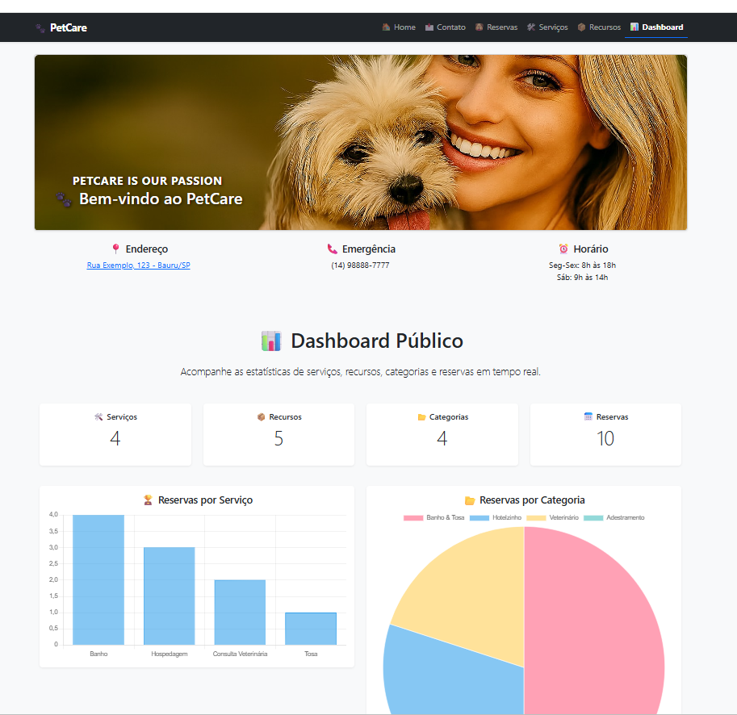

# 🐾 django-petcare-reservation-api

## 🚀 Django Project  
### 📬 Contatos + 📅 Reservas + 🐾 Categorias + 🌐 API REST + 🧪 Testes Automatizados



---

## 🏅 Badges


---

## 📑 Índice / Table of Contents

- [📖 Descrição / Description](#-descrição--description)
- [📌 Status do Projeto / Project Status](#-status-do-projeto--project-status)
- [⚙️ Funcionalidades / Features](#️-funcionalidades--features)
- [🚀 Execução / Execution](#-execução--execution)
- [🌐 Acesso / Access](#-acesso--access)
- [🧰 Tecnologias / Technologies](#-tecnologias--technologies)
- [🧪 Testes](#-testes)
  - [🧪 Tests and API Documentation – Contato Django Project](#-testes-e-documentação-da-api--projeto-contato-django)  
  - [🧪 Testes da API / API Tests](#-testes-da-api--api-tests)
  - [🧪 Testes com Postman / Postman Tests](#-testes-com-postman--postman-tests)
- [⚙️ Configuração do Ambiente / Environment Setup](#️-configuração-do-ambiente--environment-setup)
- [▶️ Endpoints disponíveis / Available Endpoints](#️-endpoints-disponíveis--available-endpoints)
- [🔎 Exemplos de uso / Usage Examples](#-exemplos-de-uso--usage-examples)
- [🔑 Obtendo o Token / Getting the Token](#-obtendo-o-token--getting-the-token)
- [📌 Evolução / Evolution](#-evolução)
- [🕒 Linha do Tempo / Timeline](#-linha-do-tempo--timeline)
- [🔄 Comparativo de Evolução / Evolution Comparison](#-comparativo-de-evolução--evolution-comparison)
- [👨‍💻 Desenvolvedor / Developer](#-desenvolvedor--developer)
- [📜 Licença / License](#-licença--license)
- [🏁 Conclusão / Conclusion](#-conclusão--conclusion)

---

## 📖 Descrição / Description

**PT:**  
Este projeto é a evolução de um mini projeto Django. Agora, além da página de contato, foi adicionado um **sistema de reservas**, um módulo de **categorias de animais**, uma **API REST completa** com **Django REST Framework**, autenticação via Token e **testes automatizados** com Pytest e Coverage.  

**EN:**  
This project is the evolution of a Django mini project. In addition to the contact page, it now includes a **reservation system**, an **animal categories module**, a **full REST API** with **Django REST Framework**, token-based authentication, and **automated tests** with Pytest and Coverage.  

---

## 📌 Status do Projeto / Project Status


**PT:**  
Este projeto está **ativo e em evolução**. Novas funcionalidades podem ser adicionadas ao longo do tempo.  

**EN:**  
This project is **active and evolving**. New features may be added over time.  

---

## ⚙️ Funcionalidades / Features

| 🧩 Funcionalidade (PT)                          | 💡 Description (EN)                          |
|------------------------------------------------|----------------------------------------------|
| 📬 Página de contato em `/contato/`            | 📬 Contact page at `/contato/`               |
| 📅 Página de reservas em `/reserva/`           | 📅 Reservation page at `/reserva/`           |
| 🐾 Gestão de categorias de animais             | 🐾 Animal categories management              |
| 🔗 Relacionamento Categoria ↔ Reserva com endpoint `/api/categorias/<id>/reservas/` | 🔗 Category ↔ Reservation relationship with endpoint `/api/categorias/<id>/reservations/` |
| 💾 Salvamento no banco de dados                | 💾 Database persistence                      |
| 🔐 Gerenciamento via Django Admin              | 🔐 Management via Django Admin               |
| 🎨 Templates com Bootstrap + CSS customizado   | 🎨 Templates styled with Bootstrap + custom CSS |
| 🌐 API REST para Contatos, Reservas e Categorias | 🌐 REST API for Contacts, Reservations and Categories |
| 🔎 Filtros, busca e ordenação na API           | 🔎 Filters, search and ordering in API       |
| 🧪 Testes via Postman Collection e Pytest      | 🧪 Testing via Postman Collection and Pytest |

---

## 🚀 Execução / Execution

**PT-BR:**

1. Clone o repositório  
   ```bash
   git clone https://github.com/Rogerio5/django-contact-reservation-api.git
   cd django-contact-reservation-api
2. Crie um ambiente virtual e instale as dependências
   ```bash
   python -m venv venv
   venv\Scripts\activate   # Windows
   source venv/bin/activate  # Linux/Mac
   pip install -r requirements.txt
   pip install -r requirements-dev.txt   # dependências de desenvolvimento
   ```
3. Reinicie o banco de dados
   ```bash
   python resetdb.py
   ```
4. Popule o banco com dados iniciais (seed)
   ```bash
   python seed.py
   ```
5. Execute as migrações (se necessário)
   ```bash
   python manage.py migrate
   ```
6. Crie um superusuário
   ```bash
   python manage.py createsuperuser
   ```
7. Rode o servidor
   ```bash
   python manage.py runserver
   ```
8. Acesse no navegador

    Contato: http://127.0.0.1:8000/contato/
    
    Reservas: http://127.0.0.1:8000/reserva/
    
    Admin: http://127.0.0.1:8000/admin/
    
    API Contatos: http://127.0.0.1:8000/contato/api/contatos/
    
    API Reservas: http://127.0.0.1:8000/contato/api/reservas/

**EN**

1. Clone the repository

```bash
git clone https://github.com/Rogerio5/django-contact-reservation-api.git
cd django-contact-reservation-api
```
2. Create a virtual environment and install dependencies

```bash
python -m venv venv
venv\Scripts\activate   # Windows
source venv/bin/activate  # Linux/Mac
pip install -r requirements.txt
pip install -r requirements-dev.txt   # development dependencies
```
3. Reset the database

```bash
python resetdb.py
```
4. Seed the database with initial data

```bash
python seed.py
```
5. Run migrations

```bash
python manage.py migrate
```
6. Create a superuser

```bash
python manage.py createsuperuser
```
7. Start the server

```bash
python manage.py runserver
```
8. Access in browser

  Contact: http://127.0.0.1:8000/contato/
  
  Reservations: http://127.0.0.1:8000/reserva/
  
  Admin: http://127.0.0.1:8000/admin/
  
  Contacts API: http://127.0.0.1:8000/contato/api/contatos/
  
  Reservations API: http://127.0.0.1:8000/contato/api/reservas/

---

## 🌐 Acesso / Access

- [🔗 Repositório GitHub / GitHub Repository](https://github.com/Rogerio5/django-petcare-reservation-api)

---

## 🧰 Tecnologias / Technologies

**PT:**  
Este projeto foi desenvolvido utilizando as seguintes tecnologias e ferramentas:  

**EN:**  
This project was built using the following technologies and tools:  

<p align="left">
  <!-- Linguagem -->
  
  
  <!-- Framework principal -->
  
  
  <!-- Banco de dados -->
  
  
  <!-- Frontend -->
  
  
  
  
  
  <!-- API -->
  
  
  <!-- Testes -->
  
  
  
  
  <!-- Versionamento -->
  
  
</p>

---

# 🧪 Testes e Documentação da API – Projeto Contato Django  
# 🧪 Tests and API Documentation – Contato Django Project  

Este projeto possui uma suíte de testes **automatizados** (com `pytest` + Django) e também uma documentação clara dos **endpoints da API** para facilitar testes manuais (via Postman ou navegador).  
This project includes an **automated test suite** (with `pytest` + Django) and clear documentation of the **API endpoints** to facilitate manual testing (via Postman or browser).  

---

## 📂 Estrutura da Suíte de Testes / Test Suite Structure

| Arquivo / File | Cobre / Covers |
|----------------|----------------|
| **`test_models.py`** | Testes de `__str__` e helpers de `Mensagem`, `Categoria`, `Reserva`, `Recurso`, `Servico`. <br> Tests for `__str__` and helpers of `Mensagem`, `Categoria`, `Reserva`, `Recurso`, `Servico`. |
| **`test_forms.py`** | Validação de formulários (`MensagemForm`, `ReservaForm`). <br> Form validation (`MensagemForm`, `ReservaForm`). |
| **`test_views.py`** | Views Django tradicionais: homepage, envio de mensagens e reservas via formulário. <br> Traditional Django views: homepage, sending messages and reservations via form. |
| **`test_api_contatos_auth.py`** | Views Django para mensagens e reservas (formulários), válidos e inválidos. <br> Django views for messages and reservations (forms), valid and invalid. |
| **`test_api_contatos.py`** | API REST de contatos (`/api/contatos/`): listagem e criação. <br> Contacts REST API (`/api/contatos/`): listing and creation. |
| **`test_api_auth.py`** | Autenticação na API de reservas: 401 sem login, sucesso com login. <br> Reservation API authentication: 401 without login, success with login. |
| **`test_api_reserva_regra.py`** | API de categorias (`/api/categorias/`): CRUD + endpoint `/categorias/<id>/reservas/`. <br> Categories API (`/api/categorias/`): CRUD + endpoint `/categorias/<id>/reservas/`. |
| **`test_reserva_regra.py`** | Regra de negócio via formulário: máximo 4 reservas/dia. <br> Business rule via form: max 4 reservations/day. |
| **`test_api_reservas.py`** | CRUD completo da API de reservas (`/api/reservas/`) + regra de negócio. <br> Full CRUD of reservations API (`/api/reservas/`) + business rule. |

---

## 🧪 Testes

🔹 **Testes Automatizados (Django + Pytest)**

1. **Rodar todos os testes**
   ```bash
   pytest
2. Rodar com cobertura
   
   ```bash
   pytest --cov
   ```
3. Gerar relatório em HTML

   ```bash
   coverage html
   ```
4. Abrir no navegador

   Código
   htmlcov/index.html
   
   ✅ Cobertura atual: 98%
   


---

## 🧪 Testes da API / API Tests

### 📬 Contatos / Contacts

- **GET `/api/contatos/`**  
  - PT: lista todos os contatos  
  - EN: lists all contacts  

- **POST `/api/contatos/`**  
  - PT: cria um novo contato  
  - EN: creates a new contact  

- **GET `/api/contatos/<id>/`**  
  - PT: retorna os detalhes de um contato específico  
  - EN: returns details of a specific contact  

- **PUT `/api/contatos/<id>/`**  
  - PT: atualiza um contato existente  
  - EN: updates an existing contact  

- **DELETE `/api/contatos/<id>/`**  
  - PT: exclui um contato  
  - EN: deletes a contact  

---

### 📅 Reservas / Reservations

- **GET `/api/reservas/`**  
  - PT: lista todas as reservas  
  - EN: lists all reservations  

- **POST `/api/reservas/`**  
  - PT: cria uma nova reserva  
  - EN: creates a new reservation  

- **GET `/api/reservas/<id>/`**  
  - PT: retorna os detalhes de uma reserva específica  
  - EN: returns details of a specific reservation  

- **PUT `/api/reservas/<id>/`**  
  - PT: atualiza uma reserva existente  
  - EN: updates an existing reservation  

- **DELETE `/api/reservas/<id>/`**  
  - PT: exclui uma reserva  
  - EN: deletes a reservation  

---

### 🐾 Categorias / Categories

- **GET `/api/categorias/`**  
  - PT: lista todas as categorias  
  - EN: lists all categories  

- **POST `/api/categorias/`**  
  - PT: cria uma nova categoria  
  - EN: creates a new category  

- **GET `/api/categorias/<id>/`**  
  - PT: retorna os detalhes de uma categoria específica  
  - EN: returns details of a specific category  

- **PUT `/api/categorias/<id>/`**  
  - PT: atualiza uma categoria existente  
  - EN: updates an existing category  

- **DELETE `/api/categorias/<id>/`**  
  - PT: exclui uma categoria  
  - EN: deletes a category  

- **GET `/api/categorias/<id>/reservas/`**  
  - PT: retorna todas as reservas (animais) de uma categoria específica  
  - EN: returns all reservations (animals) of a specific category  

---

### 🔎 Filtros e Busca / Filters and Search

- **`?data=2025-09-30`**  
  - PT: filtra reservas por data  
  - EN: filters reservations by date  

- **`?search=Rex`**  
  - PT: busca reservas pelo nome do pet  
  - EN: searches reservations by pet name  

- **`?ordering=-data`**  
  - PT: ordena reservas por data decrescente  
  - EN: orders reservations by date (descending)  

---

## 🧪 Testes com Postman / Postman Tests

**PT:**  
Este projeto já inclui uma **coleção do Postman** (`postman_collection.json`) para facilitar os testes da API.  
A coleção cobre **CRUD completo** para **Contatos, Reservas e Categorias**, além de um **endpoint especial** que retorna todas as reservas de uma categoria específica.  

**EN:**  
This project already includes a **Postman collection** (`postman_collection.json`) to make API testing easier.  
The collection covers **full CRUD** for **Contacts, Reservations, and Categories**, plus a **special endpoint** that returns all reservations of a specific category.  

---

### ⚙️ Configuração do Ambiente / Environment Setup

| Variável / Variable | Valor (exemplo) / Example Value | Descrição / Description |
|---------------------|---------------------------------|--------------------------|
| `auth_token`        | `seu_token_gerado_no_django` / `your_token_generated_in_django` | Token de autenticação (obtido via login ou admin) / Authentication token (obtained via login or admin) |
| `url`               | `http://127.0.0.1:8000`         | Endereço base da API / Base URL of the API |

**PT:**  
1. Abra o **Postman** → **Environments** → **Add**.  
2. Crie um ambiente chamado **Django API**.  
3. Adicione as variáveis acima.  
4. Clique em **Save** e selecione o ambiente no canto superior direito.  

**EN:**  
1. Open **Postman** → **Environments** → **Add**.  
2. Create an environment named **Django API**.  
3. Add the variables above.  
4. Click **Save** and select the environment in the top right corner.  

---

### ▶️ Endpoints disponíveis / Available Endpoints

- **Contatos / Contacts** → CRUD completo em `/api/contatos/`  
- **Reservas / Reservations** → CRUD completo em `/api/reservas/`  
- **Categorias / Categories** → CRUD completo em `/api/categorias/`  
  - **GET `/api/categorias/<id>/reservas/`** → retorna todas as reservas (animais) de uma categoria específica / returns all reservations (animals) of a specific category  

---

### 🔎 Exemplos de uso / Usage Examples

- **Listar Contatos / List Contacts** → `GET {{url}}/contato/api/contatos/`  
- **Criar Contato / Create Contact** → `POST {{url}}/contato/api/contatos/`  
- **Listar Reservas / List Reservations** → `GET {{url}}/contato/api/reservas/`  
- **Criar Reserva / Create Reservation** → `POST {{url}}/contato/api/reservas/`  
- **Listar Categorias / List Categories** → `GET {{url}}/contato/api/categorias/`  
- **Reservas de uma Categoria / Reservations of a Category** → `GET {{url}}/contato/api/categorias/1/reservas/`  

---

### 🔑 Obtendo o Token / Getting the Token

**PT:**  
1. Crie um usuário no Django Admin ou via `createsuperuser`.  
2. Gere o token de autenticação:  
   ```bash
   python manage.py drf_create_token <seu_usuario>
   ou acesse pelo Django Admin → Tokens.

3. Copie o token e cole no campo auth_token do ambiente no Postman.

EN:

1. Create a user in Django Admin or via `createsuperuser`.

2. Generate the authentication token:

```bash
python manage.py drf_create_token <your_user>
or access it through Django Admin → Tokens.
```
3. Copy the token and paste it into the auth_token field of the Postman environment.

---

## 📌 Evolução

**PT:**  
Este projeto é a **terceira etapa** da evolução iniciada com o [Django-Mini-Project---Contact-Page-Ultima](https://github.com/Rogerio5/Django-Mini-Project---Contact-Page-Ultima).  

- **Projeto inicial:** apenas uma página de contato simples.  
- **Segunda etapa:** ampliação para incluir reservas, categorias de animais e uma API REST com Django REST Framework.  
- **Projeto atual (terceira parte):** sistema completo com:
  - 📅 **Sistema de reservas**  
  - 🐾 **Módulo de categorias de animais**, relacionado diretamente às reservas  
  - 🌐 **API REST completa** com Django REST Framework  
  - 🔍 **Filtros, busca e ordenação**  
  - 🔑 **Autenticação via Token** para proteger endpoints  
  - 🧪 **Testes automatizados** com Pytest e Postman Collection  
  - ✅ **Cobertura de testes: 98%**  

---

**EN:**  
This project is the **third stage** of the evolution that started with [Django-Mini-Project---Contact-Page-Ultima](https://github.com/Rogerio5/Django-Mini-Project---Contact-Page-Ultima).  

- **Initial project:** only a simple contact page.  
- **Second stage:** expanded to include reservations, animal categories, and a REST API with Django REST Framework.  
- **Current project (third part):** a complete system with:
  - 📅 **Reservation system**  
  - 🐾 **Animal categories module**, directly linked to reservations  
  - 🌐 **Full REST API** with Django REST Framework  
  - 🔍 **Filtering, search, and ordering**  
  - 🔑 **Token-based authentication** to secure endpoints  
  - 🧪 **Automated tests** with Pytest and Postman Collection  
  - ✅ **Test coverage: 98%**  

---

## 🕒 Linha do Tempo / Timeline

```text
📌 Projeto 1 – Contact Page
   • Página de contato simples
   • Django + SQLite + Bootstrap
   • Testes manuais

⬇️ Evolução

📌 Projeto 2 – Contact + Reservas + API
   • Sistema de reservas
   • Categorias de animais
   • API REST com Django REST Framework
   • Testes via Postman

⬇️ Evolução

📌 Projeto 3 – Sistema Completo
   • Reservas + Categorias + Contatos
   • API REST robusta (CRUD + filtros + busca + ordenação)
   • Autenticação via Token
   • Testes automatizados (Pytest + Coverage)
   • ✅ Cobertura de 98%
```
## 🔄 Comparativo de Evolução / Evolution Comparison

| Aspecto / Aspect        | Projeto Anterior – *Contact Page* (PT) <br> Previous Project – *Contact Page* (EN) | Projeto Atual – *Contact + Reservas + API* (PT) <br> Current Project – *Contact + Reservations + API* (EN) |
|--------------------------|----------------------------------------------------------------------------------------------------------------|----------------------------------------------------------------------------------------------------------------|
| **Objetivo / Goal**      | Página de contato simples <br> Simple contact page | Sistema completo com contatos, reservas e categorias <br> Complete system with contacts, reservations, and categories |
| **Funcionalidades / Features** | Formulário de contato <br> Contact form | CRUD completo via API + Reservas + Categorias <br> Full CRUD via API + Reservations + Categories |
| **Tecnologias / Technologies** | Django, SQLite, Bootstrap | Django, DRF, django-filter, Pytest, Coverage |
| **Interação / Interaction** | HTML + Admin | HTML + Admin + API REST |
| **Testes / Tests**       | Manuais <br> Manual | Postman + Pytest (98% cobertura) <br> Postman + Pytest (98% coverage) |
| **Autenticação / Authentication** | Não havia <br> None | Token-based |

---

## 👨‍💻 Desenvolvedor / Developer

- [Rogerio](https://github.com/Rogerio5)

---

## 📜 Licença / License

Este projeto está sob licença MIT. Para mais detalhes, veja o arquivo `LICENSE`.  

This project is under the MIT license. For more details, see the `LICENSE` file.

---

🏁 Conclusão / Conclusion
PT: O projeto django-contact-reservation-api evoluiu de um exercício acadêmico para um mini sistema completo, com contatos, reservas, categorias, API REST, autenticação via Token e testes automatizados. Com 98% de cobertura de testes, o sistema é robusto, confiável e pronto para ser usado como portfólio profissional ou base para sistemas reais (clínicas veterinárias, pet shops, agendas online).

EN: The django-contact-reservation-api evolved from an academic exercise into a complete mini system, with contacts, reservations, categories, REST API, token-based authentication, and automated tests. With 98% test coverage, the system is robust, reliable, and ready to be showcased as a professional portfolio project or used as a foundation for real-world systems (veterinary clinics, pet shops, online booking platforms).

